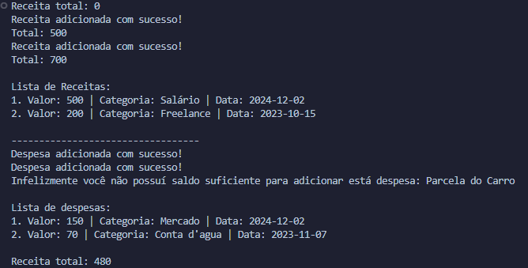

# Budget Manager V1.0

Um gerenciador de orçamento simples em Python que funciona inteiramente pelo terminal. Atualmente, ele permite:

- Adicionar receitas.
- Listar receitas.
- Remover receitas.

- Adicionar despesas.
- Listar despesas.
- Remover despesas.

## Demonstração

## Próximos Passos

- ✅ Implementar a funcionalidade de despesas.
- ⬜ Adicionar suporte a banco de dados.
- ⬜ Criar uma interface gráfica com Flet.

